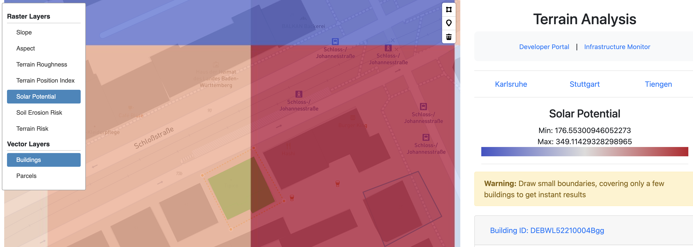
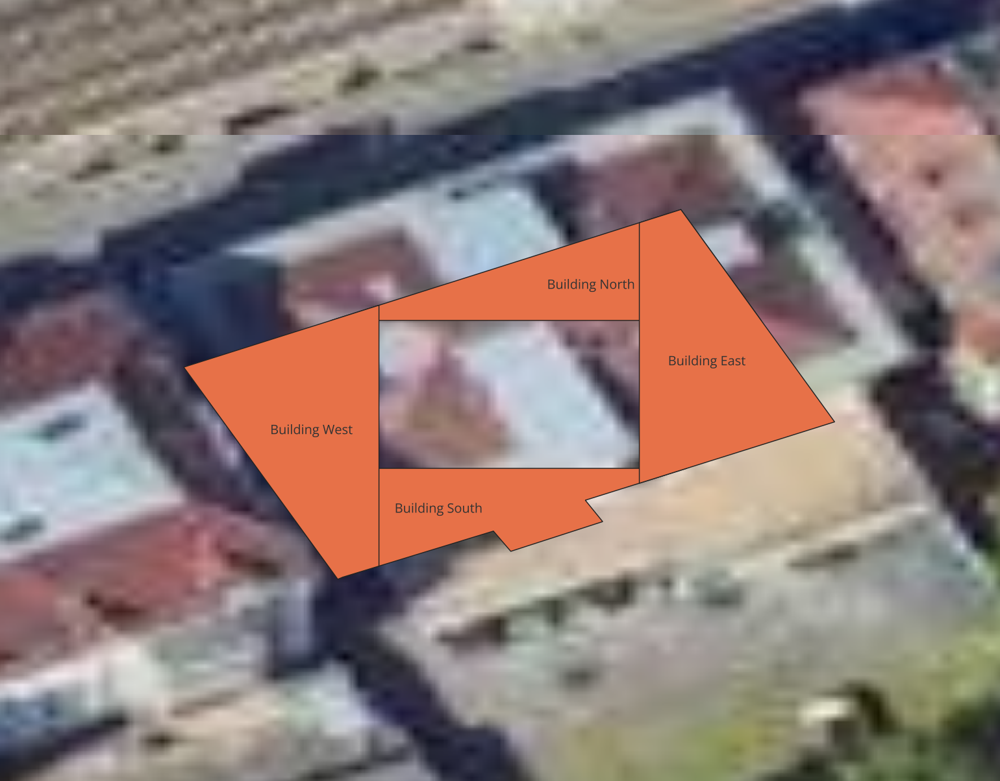
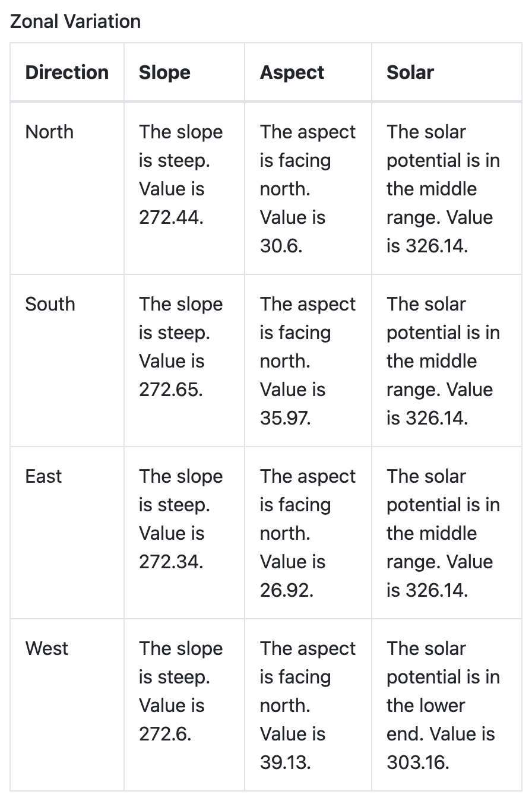

User can extract insights from the web application by either dropping a `Point` on a footprint of interest or extract insights for multiple footprints by drawing a `Polygon`.

The backend is limited to resources and doesn't have any node-scaling, as a result, if you select a big area only 10 random footprints are sampled for processing. On the UI, you'd see the processed buildings in ``green`` color as in the picture above.

User can enable the buildings layer, then enable a raster layer and finally perform a detailed analysis for any footprint. The results appear on the right under a ``collapsible`` section identified by ``Building ID ``.

The analysis performed in two different ways:

* Zonal-level Variation: In this, a footprint is divided into 4 zones approximately, North-East-West-South based on the coordinates. A textual interpretation is then provided for `mean` values observed in each of the zones, for example, is some value is high, low, or medium. This focuses on internal divisions of the building footprint to analyze terrain variations directly under the building.

Refer the screenshots below:

Following kind of table is produced for each Building:

* Neighborhood Variation: In this, the opposite is analysed, a small buffer is drawn around the building footprint, the footprint itself is removed so as to only include the ring structure around the building. A similar analysis is performed for the resulting region. This can be useful for example to analyse how the surrounding terrain can create problems for the current footprint

A similar tabular output is produced for Neighborhood analysis

